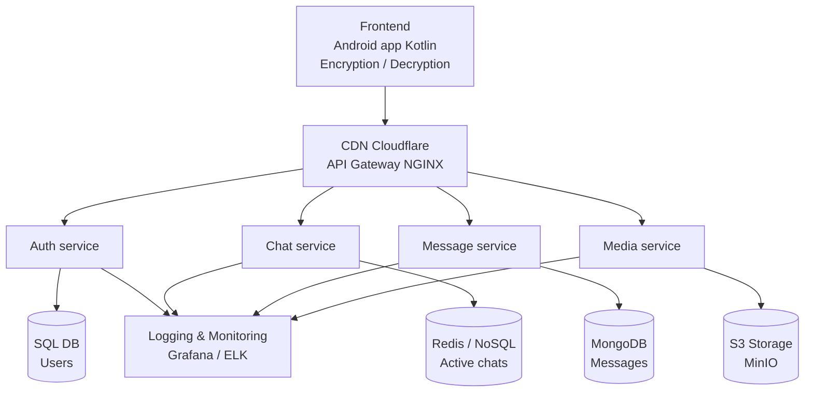
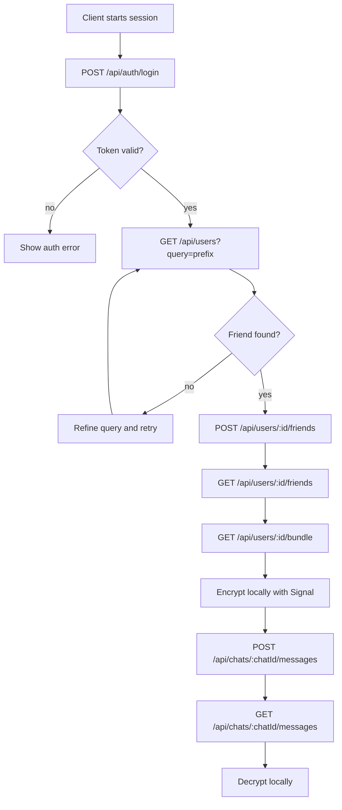
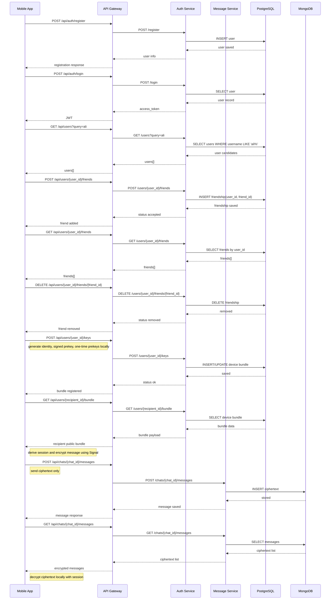

# E2EE Chat App (NUKS projekt)

Cloud-native end-to-end encrypted chat aplikacija, razvita v okviru predmeta NUKS.
Projekt sledi zahtevam predmeta: mikrostoritve, Docker Compose, API gateway,
relacijska + nerelacijska baza, centralizirano logiranje, CI/CD in uporaba S3 API.

## 1. Povzetek ideje

E2EE je mobilna chat aplikacija (Android), kjer je vsebina sporocil
sifrirana na odjemalcu in se dekriptira samo na odjemalcu prejemnika.
Backend ne vidi plaintext sporocil, ampak obdeluje avtentikacijo,
upravljanje chatov, metapodatke, medijske datoteke in dostavo sporocil.

Glavni cilj projekta je pokazati prakticno uporabo cloud-native vzorcev:
- razbitje sistema na mikrostoritve,
- horizontalno skaliranje,
- opazljivost (logi + metrike),
- avtomatizirana dostava (CI/CD).

## 2. Arhitektura sistema

Arhitektura je pripravljena po skici iz navodil:



## 3. Signal encryption workflow diagram

The project includes a precise Signal-style encryption workflow diagram.
The diagram shows:
- client-side key generation and bundle registration
- friend discovery and friend management (search/add/list/remove)
- recipient bundle retrieval
- local encryption before sending
- storage of ciphertext in the message service
- local decryption after retrieval

### API calling flowchart (friend + chat flow)





You can export the diagram with Mermaid tools:
- use `https://mermaid.live`
- paste the Mermaid code
- export as SVG/PNG/PDF

## 4. Mikrostoritve in odgovornosti

### 3.1 Auth service
- Registracija, prijava, osvezevanje tokenov.
- Upravljanje uporabniskih profilov in javnih kljucev.
- Iskanje uporabnikov in upravljanje prijateljev.
- Signal key bundle endpointi (identity key, signed prekey, one-time prekeys).
- Relacijska baza (npr. PostgreSQL/MySQL) za uporabnike.

### 3.2 Chat service
- Ustvarjanje chatov (1:1 in skupinski).
- Upravljanje clanov chata in statusov (active, archived).
- Redis/NoSQL za hitre poizvedbe aktivnih chatov.

### 3.3 Message service
- Sprejem in dostava sifriranih sporocil (ciphertext + metadata).
- Zgodovina sporocil in paginacija.
- MongoDB za shranjevanje sporocil.

### 3.4 Media service
- Upload/download medijskih datotek preko S3 API.
- Integracija z MinIO instanco.
- Generiranje signed URL za varen dostop.

### 3.5 API Gateway (NGINX)
- Enotna vstopna tocka za kliente.
- Reverse proxy do posameznih storitev.
- Rate limiting, CORS, osnovni security headers.

### 3.6 CDN in DNS (Cloudflare)
- TLS terminacija, DNS, caching staticnih vsebin.
- Zascita pred osnovnimi DDoS napadi.

## 4. Predlagani API klici (Mejnik 2)

### Auth
- POST /api/auth/register
- POST /api/auth/login
- POST /api/auth/refresh
- GET /api/users/me
- GET /api/users/:id/public-key
- GET /api/users?query=:usernamePrefix
- POST /api/users/:id/keys
- GET /api/users/:id/bundle

### Friends
- POST /api/users/:id/friends
- GET /api/users/:id/friends
- DELETE /api/users/:id/friends/:friendId

### Chat
- POST /api/chats
- GET /api/chats
- GET /api/chats/:chatId
- POST /api/chats/:chatId/members
- DELETE /api/chats/:chatId/members/:userId

### Message
- POST /api/chats/:chatId/messages
- GET /api/chats/:chatId/messages?cursor=...&limit=...
- GET /api/messages/:messageId
- DELETE /api/messages/:messageId

### Media
- POST /api/media/upload-url
- POST /api/media/complete
- GET /api/media/:mediaId/download-url

### API calling notes
- Vsi endpointi razen `/health` in `/api/auth/register` potrebujejo `Authorization: Bearer <JWT>` header.
- `GET` endpointi uporabljajo query parametre (npr. `/api/chats?user_id=...`), ne request body.
- Za prijatelje priporocen vrstni red klicev je:
    1. `GET /api/users?query=...`
    2. `POST /api/users/:id/friends`
    3. `GET /api/users/:id/friends`
    4. (opcijsko) `DELETE /api/users/:id/friends/:friendId`
- Za hiter smoke test API-ja uporabi `postman_collection.json` + `postman_environment.json` iz repozitorija.

## 5. Podatkovni sloj

- Relacijska baza: uporabniki, auth podatki, osnovni profil.
- Nerelacijska baza: sporocila (MongoDB) + aktivni chati/caching (Redis).
- S3 objektna shramba: slike, video, dokumenti (MinIO).

## 6. Mejniki projekta

| Mejnik | Datum | Zahteve | Status |
|---|---|---|---|
| Mejnik 1 | 9.4 | Ideja + skica arhitekture | Done |
| Mejnik 2 | 23.4 | API klici + plan segmentacije mikrostoritev | In progress |
| Mejnik 3 | 7.5 | Implementirane mikrostoritve + docker compose | Planned |
| Mejnik 4 | 21.5 | Logiranje + CI/CD pipeline | Planned |

## 7. Tehnicne zahteve in pokritost

- Git repozitorij: da.
- Frontend + backend: da (Android frontend + backend mikrostoritve).
- Mikrostoritve + Docker Compose: da.
- 1 relacijska + 1 nerelacijska baza: da (SQL + MongoDB/Redis).
- API gateway/proxy: da (NGINX).
- Centralizirano logiranje: da (ELK/Grafana stack).
- CI/CD pipeline: da (GitHub Actions).
- Cloudflare account: da.
- S3 API (MinIO): da.

## 8. Predlagana struktura repozitorija

```text
E2EE/
	README.md
	services/
		auth-service/
		chat-service/
		message-service/
		media-service/
		api-gateway/
	mobile/
		android-app/
	infra/
		docker-compose.yml
		nginx/
		monitoring/
	.github/
		workflows/
```

## 9. Docker Compose (ciljna slika)

V produkciji je predviden Kubernetes, za laboratorijske mejnike pa lokalni
zagon preko Docker Compose z naslednjimi storitvami:
- api-gateway
- auth-service
- chat-service
- message-service
- media-service
- postgres ali mysql
- mongodb
- redis
- minio
- log stack (npr. elk ali prometheus+loki+grafana)

## 10. CI/CD plan

Primer pipeline korakov (GitHub Actions):
1. Lint + unit testi za vse storitve.
2. Build Docker slik za mikrostoritve.
3. Security scan (npr. Trivy).
4. Push slik v registry.
5. Deploy na test okolje (compose ali k8s).

## 11. Varnost in E2EE opombe

- Kljuce in sifriranje upravlja odjemalec (Android app).
- Backend hrani samo ciphertext in metadata sporocil.
- Prenos podatkov je zasciten s TLS.
- JWT + refresh token flow za avtentikacijo.

## 12. Ekipa

- Student 1
- Student 2

Po potrebi zamenjajta imena in dopolnita podrobnosti implementacije,
ko bo posamezen mejnik zakljucen.
